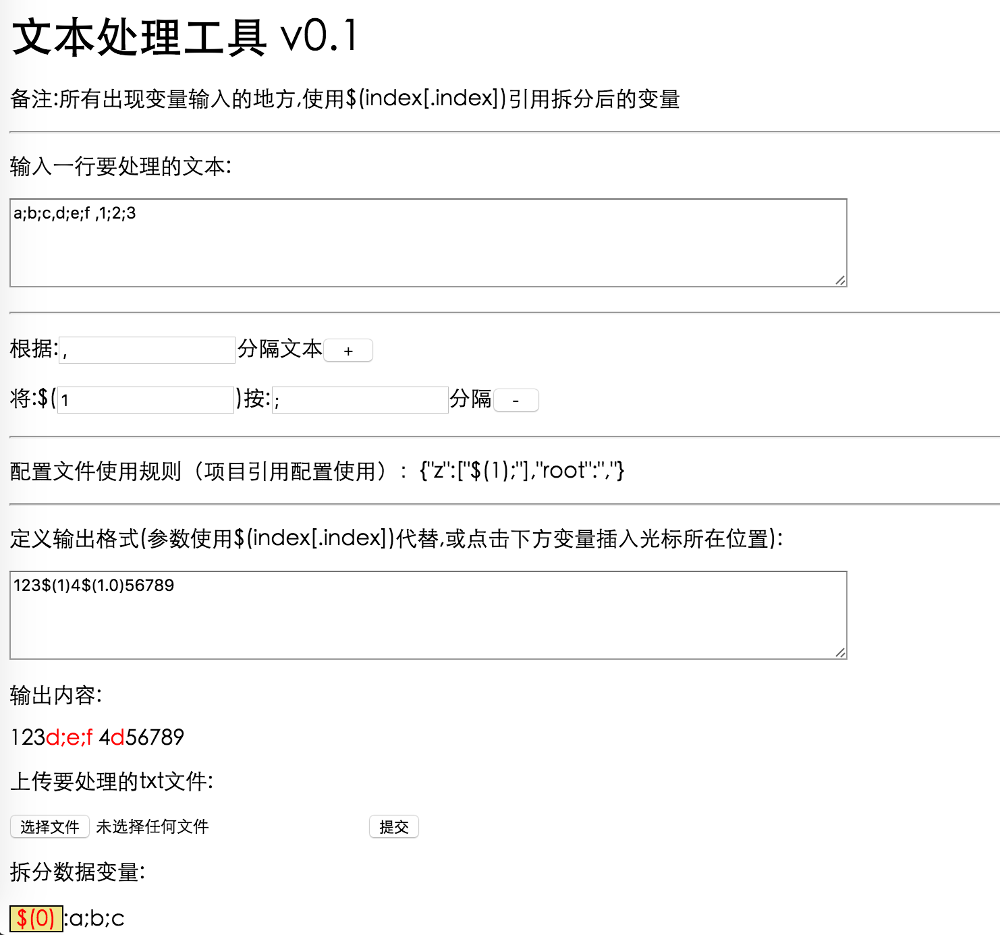

#txt-util
[](https://www.apache.org/licenses/LICENSE-2.0.html)
[](https://maven-badges.herokuapp.com/maven-central/com.jianpage/txt-util)

简单的文本处理小程序

## 程序引用方法
### 1.在项目中添加maven依赖 (或者直接下载build下的txt-util-0.1-RELEASE.jar)包
 
```xml
        <dependency>
            <groupId>com.jianpage</groupId>
            <artifactId>txt-util</artifactId>
            <version>0.1-RELEASE</version>
        </dependency>
        <dependency>
            <groupId>org.slf4j</groupId>
            <artifactId>slf4j-api</artifactId>
            <version>1.7.21</version>
        </dependency>
        <dependency>
            <groupId>log4j</groupId>
            <artifactId>log4j</artifactId>
            <version>1.2.17</version>
        </dependency>
        <dependency>
            <groupId>com.alibaba</groupId>
            <artifactId>fastjson</artifactId>
            <version>1.2.12</version>
        </dependency>
```

如果已有slf4j和fastjson依赖则只添加txt-util即可

### 2.添加资源文件txtutil.properties 

在项目资源目录下添加 `txtutil.properties` 文件,内容格式如:
```
test={"z":["$(0);"],"root":","}
```

可在页面配置规则时获取输出的规则

### 3.程序中引用 

```java
/**
* 参数 配置规则key, 输出内容模板, 需要处理内容
* 返回 按模板输出处理后的内容String
*/
TxtUtil.handle("test", template, line);
```

## 运行环境
>jdk1.7+ 
>maven3+

## 程序启动
可以使用如下方法运行本程序

* 直接下载build目录下的对应版本txt-util.jar到本地(基于jdk1.8版本编译请确认本地使用版本,如底于1.8请自行编译)

    跳转到保存目录后使用java -jar txt-util.jar 命令启动服务

* 或者使用git clone 下载本资源库

    下载后进入项目目录执行 mvn 命令打包,再使用java -jar target/txt-util***.jar 启动服务

程序默认使用8000端口,如需要修改可以修改源码中的application.properties
或者在jar包同目录下创建application.properties文件,添加内容:
>server.port=8000

端口号改为自己需要的端口,启动使用使用 java -jar txt-util.jar --spring.config.location=./application.properties


启动完成后在浏览器中输入 http://localhost:8000 打开程序

## 界面说明
* 截图


